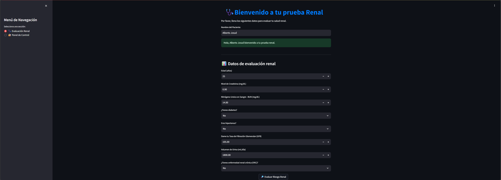

# 🩺 Renal Risk Prediction App

A **Machine Learning web application** to predict the risk of kidney disease using clinical parameters.  
Built with **Python, Streamlit, AWS (EC2 + S3), Supabase**, and deployed with **Caddy + DuckDNS (HTTPS)**.  

👉 Live demo: [RenalApp](https://renal-app-production.duckdns.org/)  

---

## ✨ Features
- 📊 **Risk prediction** with a trained Random Forest model.  
- 🔐 **Role-based access control (RBAC)**: Admin, CEO, Reader.  
- ☁️ **Cloud deployment** on AWS EC2 with HTTPS.  
- 📂 **Data storage** in Amazon S3 + Supabase (SQL database).  
- 📈 Interactive visualizations comparing patient data vs healthy ranges.  

---

## 🛠️ Tech Stack
- **Frontend / UI**: Streamlit  
- **Machine Learning**: scikit-learn (Random Forest)  
- **Backend & Auth**: Python + Supabase  
- **Cloud**: AWS EC2, S3, IAM roles  
- **Deployment**: Caddy + DuckDNS (free SSL/HTTPS)  
- **Version Control**: Git + GitHub  

---

## 📸 Screenshots

### Home
  
*Main form to input patient data.*

### Prediction Results
  
*Patient data entry before prediction.*  

  
*Visualization of prediction results and risk classification.*

### Admin Dashboard
  
*Admin dashboard with full permissions (view, download, delete).  
Other roles like Reader are limited to viewing and downloading only.*  

---

## 🚀 Getting Started
```
### 1. Clone this repo
bash
git clone https://github.com/Alberto1460/app-riesgo-renal.git
cd app-riesgo-renal

### 2. Create a virtual environment
python -m venv venv
source venv/bin/activate   # Linux/Mac
venv\Scripts\activate      # Windows

### 3. Install dependencies
pip install -r requirements.txt

### 4. Run locally
streamlit run home.py
```

---

🌍 Deployment

Deployed on AWS EC2 (free tier).

Configured with Caddy + DuckDNS for free SSL/HTTPS.

Data securely stored in Amazon S3 and Supabase.

---

📌 Future Improvements

🧮 Add more ML models for comparison.

📲 Improve responsive UI for mobile devices.

📑 Export patient reports in PDF format.

---

👨‍💻 Author

Alberto Josué Abarca López

🌐 GitHub: Alberto1460

💼 LinkedIn: [www.linkedin.com/in/alberto-josue-abarca-lopez]
